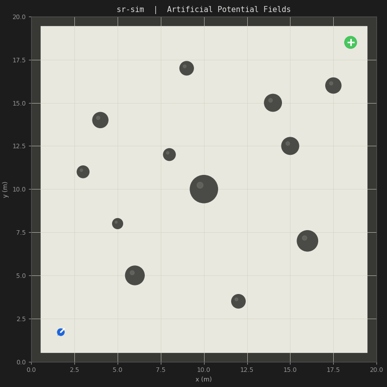

# sr-sim

A polished 2D robotics simulation platform built in Python. Pluggable planners, swarm
behaviors, YAML-configurable scenarios, and an optional Gymnasium API — all runnable
without ROS or a physics engine.

```
pip install -e .          # base
pip install -e ".[rl]"    # + Gymnasium wrapper
pip install -e ".[quantum]"  # + Qiskit decision module
```

## Quick start

```bash
python examples/01_single_robot_apf.py
```

| Control | Action |
|---------|--------|
| Left-click | Place obstacle |
| Right-click | Move goal |
| `R` | Reset robot to start |
| `ESC` / `Q` | Quit |

## Features

| Module | What it does |
|--------|-------------|
| `core/` | Diff-drive kinematics, occupancy grid, sliding collision |
| `planners/potential_field` | Artificial Potential Fields (APF) |
| `planners/pso` *(coming)* | Particle Swarm Optimization on occupancy grid |
| `planners/afsa` *(coming)* | Artificial Fish Swarm Algorithm |
| `swarm/` *(coming)* | Formation control, range-limited comms, denial zones |
| `scenarios/` *(coming)* | YAML-driven worlds with no-comm / GPS-denied zones |
| `swarm/quantum_decision` *(coming)* | Grover-style swarm decision module (Qiskit) |
| `gym_env/` *(coming)* | Gymnasium-compatible wrapper for RL training |

## Demo



## Project layout

```
src/sr_sim/
├── core/          world, robot, physics
├── planners/      APF, PSO, AFSA, A*
├── swarm/         coordinator, formation, comms, quantum_decision
├── eval/          Fréchet, DTW, rescue scoring
├── scenarios/     YAML loader + built-in maps
├── render/        pygame (interactive) + matplotlib (headless / GIF)
└── gym_env/       Gymnasium wrapper
```

## License

MIT — see [LICENSE](LICENSE).
